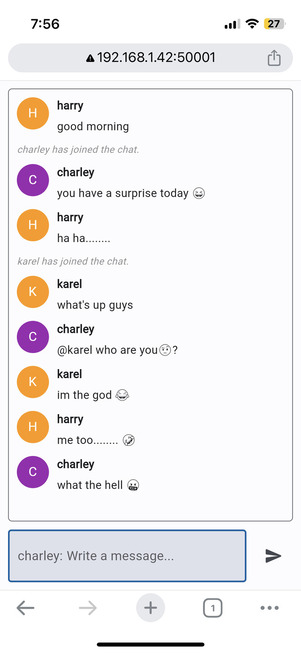

# maskedchat
**anonymous chat platform using python flet**
an  anonymous web chat platform it allows users to join with fake names or pseudonyms and participate in chat conversations while maintaining their anonymity. Other participants in the chat can see the messages sent by previous users, creating a continuous and publicly accessible conversation.

-   Flet is a framework that enables you to easily build real-time web, mobile, and desktop apps in your favorite language  [https://github.com/flet-dev/flet](https://github.com/flet-dev/flet)
